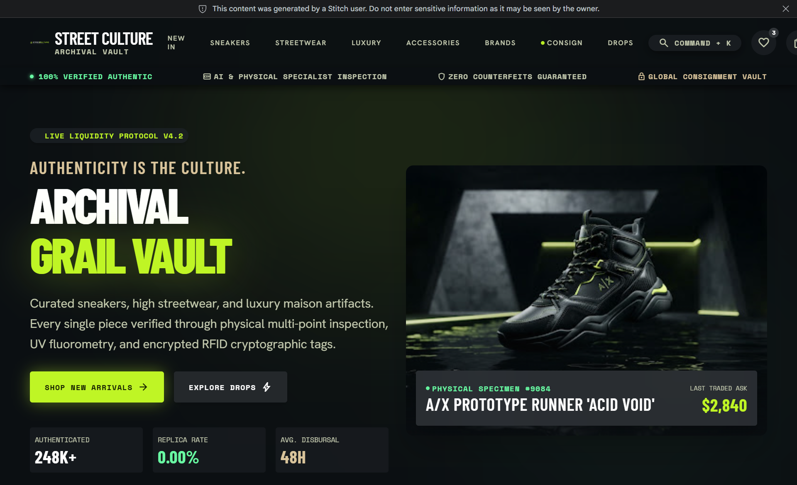

# STREET CULTURE — Archival Grail Vault & Consignment Marketplace



> **Canonical Visual Reference:** [Google Stitch Project](https://stitch.google.com/projects/8657326631814780527)  
> **Aesthetic Direction:** Modern Light-First Luxury Aesthetic with Liquid Glass / Water Glass UI, Obsidian Vault Palettes, and Specular Acid Lime Accents (`#c6ff00`).

---

## 1. Project Overview

**STREET CULTURE** is a premium authenticated fashion resale and consignment marketplace specializing in:
- Rare Archival Sneakers
- High Streetwear (Supreme, Off-White, Stussy, Corteiz, BAPE)
- Luxury Maison Garments (Dior, Prada, Louis Vuitton, Balenciaga)
- Designer Leather Goods & Bags
- Vault Hardware, Belts, & Accessories
- Curated Cultural Collectibles

Every single piece undergoes physical multi-point inspection by certified authentication specialists prior to vault release and disbursal.

---

## 2. Technology Stack & Architecture

- **Web Framework:** Next.js 15 (App Router, React 19)
- **Language:** TypeScript 5.7+ (Strict Mode)
- **Styling:** Tailwind CSS 3.4+ with custom Liquid Glass & Acid design tokens
- **Data & Auth:** Supabase (PostgreSQL 17, PostgREST, GoTrue Auth, Storage, Realtime)
- **Local Dev Stack:** Supabase CLI orchestrating local microservices
- **Containerization:** Multi-stage production Dockerfile & Docker Compose
- **Testing:** Vitest, React Testing Library, Playwright E2E
- **Package Manager:** pnpm v12 (Node.js v22 LTS)

---

## 3. System Requirements

Ensure the following tools are available on your development machine:
1. **Node.js:** v22.x LTS (`node -v`)
2. **pnpm:** v12.x (`pnpm -v`)
3. **Git:** v2.x+ (`git --version`)
4. **Supabase CLI:** v2.x+ (`supabase --version`)
5. **Docker Desktop:** With WSL2 Linux engine enabled on Windows

---

## 4. Local Development Setup (Windows / PowerShell)

### Step 1: Clone and Install Dependencies
```powershell
git clone <repository-url> street_culture
cd street_culture
pnpm install
```

### Step 2: Configure Environment Variables
Copy `.env.example` to `.env.local`:
```powershell
Copy-Item .env.example .env.local
```

### Step 3: Start Supabase Local Microservices
```powershell
# Boots PostgreSQL 17, Auth, PostgREST, Storage, Realtime, Studio, and Inbucket
supabase start
```
Check connection endpoints via:
```powershell
supabase status
```

### Step 4: Apply Database Migrations & Seed Data
```powershell
# Re-creates database schema, applies all timestamped migrations, and loads seed.sql
supabase db reset

# Regenerate TypeScript database types
pnpm db:types
```

### Step 5: Launch Next.js Development Server
```powershell
pnpm dev
```
Open **[http://localhost:3000](http://localhost:3000)** in your browser.

---

## 5. Local Service Endpoints

| Service | Local URL | Credentials / Notes |
| :--- | :--- | :--- |
| **Street Culture Web** | `http://localhost:3000` | Next.js App Router |
| **Supabase Studio** | `http://127.0.0.1:54323` | Local Web Database Administration |
| **Supabase API Gateway** | `http://127.0.0.1:54321` | REST, Auth, & Storage endpoints |
| **PostgreSQL Database** | `127.0.0.1:54322` | User: `postgres` / Pass: `postgres` |
| **Mail Testing (Inbucket)** | `http://127.0.0.1:54324` | Captures verification & reset emails |
| **Health Check API** | `http://localhost:3000/api/health` | Application status & DB probe |

---

## 6. Development Modes

### Mode A: Host Execution (Recommended)
Next.js runs natively on the Windows host machine for instantaneous Fast Refresh; Supabase is managed through the Supabase CLI.
```powershell
supabase start
pnpm dev
```

### Mode B: Containerized Execution
Next.js runs inside a multi-stage production Docker container.
```powershell
# Start containerized application
pnpm docker:up

# Stop containerized application
pnpm docker:down
```
*Note: In Docker, `host.docker.internal` is used to communicate with the host machine's Supabase instance.*

---

## 7. Package Scripts Reference

| Command | Description |
| :--- | :--- |
| `pnpm dev` | Start Next.js development server on port 3000 |
| `pnpm build` | Create optimized production standalone build |
| `pnpm start` | Run Next.js production server |
| `pnpm typecheck` | Run strict TypeScript compiler verification (`tsc --noEmit`) |
| `pnpm lint` | Execute ESLint 9 checks |
| `pnpm format` | Auto-format codebase using Prettier |
| `pnpm test` | Run Vitest unit & integration test suites |
| `pnpm test:watch` | Run Vitest in interactive watch mode |
| `pnpm test:e2e` | Run Playwright end-to-end smoke tests |
| `pnpm supabase:start` | Boot local Supabase Docker stack |
| `pnpm supabase:stop` | Halt local Supabase containers |
| `pnpm supabase:status`| Inspect ports and keys of running local Supabase stack |
| `pnpm supabase:reset` | Reset DB, rerun migrations, and load seed data |
| `pnpm db:types` | Regenerate TypeScript schema types from local Supabase |
| `pnpm docker:build` | Build Next.js application container |
| `pnpm docker:up` | Launch Next.js via Docker Compose |
| `pnpm docker:down` | Stop Next.js container |

---

## 8. Database & Migration Discipline

All database modifications must be committed as immutable timestamped migrations under `supabase/migrations/`:
```
supabase/migrations/YYYYMMDDHHMMSS_description.sql
```
Never perform uncommitted manual schema changes in Studio. Whenever a migration is modified or added:
1. Run `supabase db reset`
2. Run `pnpm db:types`
3. Commit both the migration SQL and `src/types/database.types.ts`.

---

## 9. Security Baseline

- **Row Level Security:** Enforced across all tables.
- **Server-Side Authorization:** Admin and authenticator privileges are verified through database functions with `SECURITY DEFINER` and server-side RPCs.
- **Service Role Secret Protection:** `SUPABASE_SERVICE_ROLE_KEY` is restricted strictly to server contexts and blocked from client bundles.
- **Private Media Isolation:** Consignment intake photography and physical inspection evidence reside in private storage buckets accessible solely via time-limited signed URLs.
- **One-of-One Inventory Locking:** Transactional locking prevents race conditions and duplicate checkouts of unique consignment specimens.

---

## 10. Troubleshooting

### Running Scripts Disabled on Windows
If PowerShell displays `Execution of scripts is disabled on this system`:
```powershell
Set-ExecutionPolicy -Scope CurrentUser -ExecutionPolicy RemoteSigned -Force
```

### Docker Desktop Daemon on Windows
If `supabase start` reports `failed to connect to docker API`:
1. Ensure Docker Desktop is started.
2. If WSL2 is missing, run `wsl --install` in an elevated terminal once, then restart Docker Desktop.
