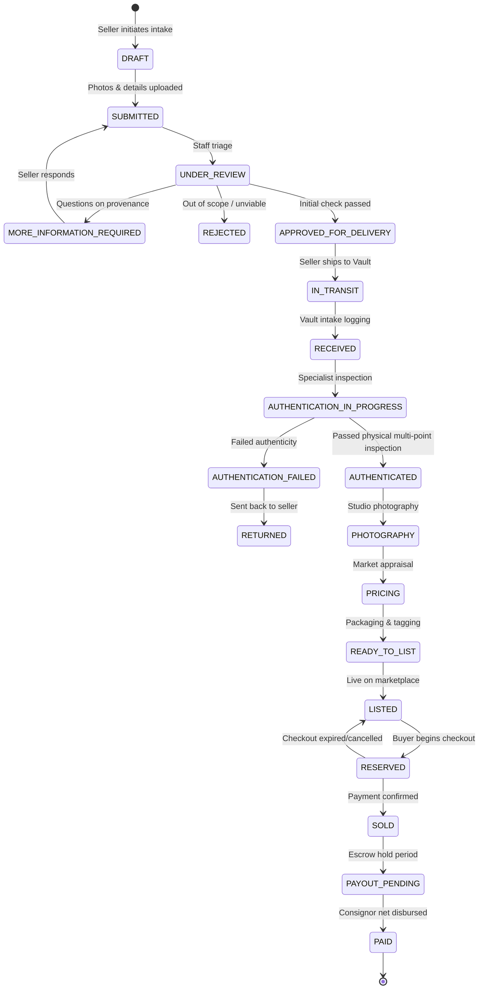

# STREET CULTURE — Consignment & Authentication Workflow

## Security Constraints
- All status transitions beyond `DRAFT` and `SUBMITTED` require authenticated staff/authenticator authorization (`public.is_authenticator()`).
- Sellers can never transition their own consignment to `AUTHENTICATED`, `SOLD`, or `PAID`.
- Every physical verification generates an immutable `authentication_records` entry linking the specialist ID, timestamp, and verification notes.
