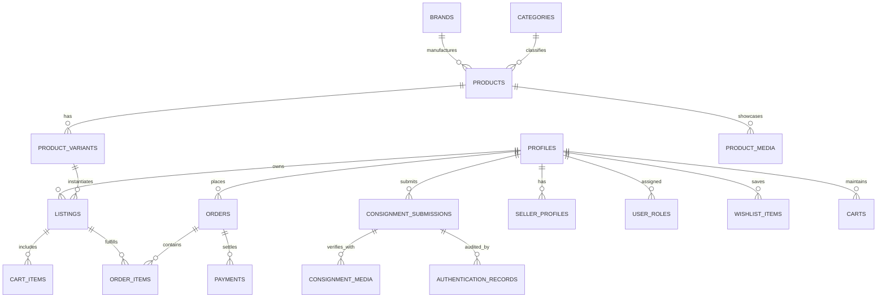

# STREET CULTURE — Database Schema & Data Dictionary

---

## Entity Relationship Overview

---

## Core Tables Summary

| Table | Description | Primary Key | Key Relationships |
| :--- | :--- | :--- | :--- |
| `profiles` | User profiles extending Supabase auth.users | UUID | `auth.users(id)` |
| `seller_profiles` | Consignor/vendor metadata and performance | UUID | `profiles(id)` |
| `user_roles` | Role-based authorization (`CUSTOMER`, `SELLER`, `STAFF`, etc.) | UUID | `auth.users(id)` |
| `brands` | Curated brands (Nike, Supreme, Jordan, etc.) | UUID | Referenced by `products` |
| `categories` | Product hierarchy (Sneakers, Luxury, etc.) | UUID | Self-referencing (`parent_id`) |
| `products` | Canonical product models & specifications | UUID | `brands(id)`, `categories(id)` |
| `product_variants` | Sizes, colorways, SKU configurations | UUID | `products(id)` |
| `product_media` | Official product gallery imagery | UUID | `products(id)` |
| `listings` | Specific inventory item for sale (condition, price) | UUID | `products`, `variants`, `profiles` |
| `consignment_submissions`| Seller intake submission lifecycle | UUID | `profiles`, `products` |
| `consignment_media` | Multi-angle verification photography | UUID | `consignment_submissions(id)` |
| `authentication_records` | Physical specialist inspection logs | UUID | `listings`, `submissions` |
| `carts` & `cart_items` | Active shopping session & item snapshots | UUID | `profiles`, `listings` |
| `orders` & `order_items` | Placed orders and immutable financial snapshots | UUID | `profiles`, `listings` |
| `payments` | Gateway-agnostic transaction records | UUID | `orders(id)` |
| `seller_payouts` | Consignor net balance disbursals | UUID | `profiles`, `order_items` |
| `commission_rules` | Tiered, configurable commission schedule | UUID | `categories`, `brands` |
| `offers` | Buyer-to-seller negotiation bids | UUID | `listings`, `profiles` |
| `notifications` | In-app alerts & state updates | UUID | `profiles(id)` |

---

## Storage Buckets

1. `avatars` (Public): Profile display images.
2. `product-images` (Public): Canonical studio imagery for catalog items.
3. `brand-assets` (Public): High-resolution brand logos and marks.
4. `editorial-assets` (Public): Hero drops and campaign visuals.
5. `consignment-media` (Private): High-resolution customer intake photography.
6. `authentication-evidence` (Private): Internal authenticator inspection logs and macro shots.
